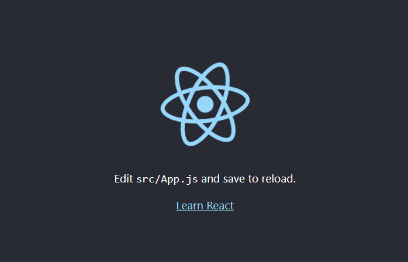

## Who wants to use CDN !

This way of using CDN links for React can be OK for testing purposes, but for production you will need to set up a **React environment.**

If you have **npx** and **Node.js** installed, you can create a React application by using `create-react-app`.

R**un this command to create a React application named my-react-app:**

```
npx create-react-app my-react-app
```

Now you are ready to run your first real React application!

**Run this command to move to the my-react-app directory:**

```
cd my-react-app
```

**Run this command to run the React application my-react-app:**

```
npm start
```

**The Ouput at http://localhost:3000 :**


## Inside App.js

```js
// edit your App.js

import React from "react";
import ReactDOM from "react-dom";

ReactDOM.render(
  <h1>Hello React!</h1>,
  document.getElementById("root")
  // make sure you've root id on your div
);
```
