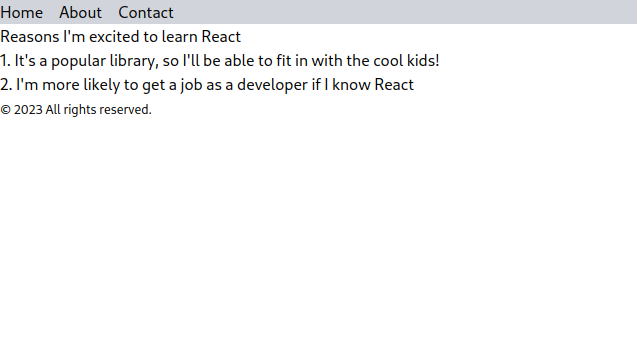

## Rendering Multiple Components in React

### Let's make a simple react app which consists :

- Header
- Hero
- Footer

### To achieve this, we'll make 4 seperate `.js` files and an `.html` file :

- `index.js`
- `Header.js`
- `App.js`
- `Footer.js`
- `index.html`

```js
// index.js

import React from "react";
import ReactDom from "react-dom";

const root = ReactDOM.createRoot(document.getElementById("root"));

root.render(<App />);
```

```js
// Header.js

function Header() {
  return (
    <nav className="bg-gray-300">
      <ul className="flex gap-4">
        <li>Home</li>
        <li>About</li>
        <li>Contact</li>
      </ul>
    </nav>
  );
}

export default Header;
// components made in seperate files are exported
```

```js
// Footer.js

function Footer() {
  return (
    <footer>
      <small>© 2023 All rights reserved.</small>
    </footer>
  );
}

export default Footer;
```

```js
// App.js

// seperate components are imported inorder to use them
import Header from "./Header";
import List from "./List";
import Footer from "./Footer";

function App() {
  return (
    <div className="App">
      <Header />
      <h1>Reasons I'm excited to learn React</h1>
      <List />
      <Footer />
    </div>
  );
}

export default App;
```

### Results :


