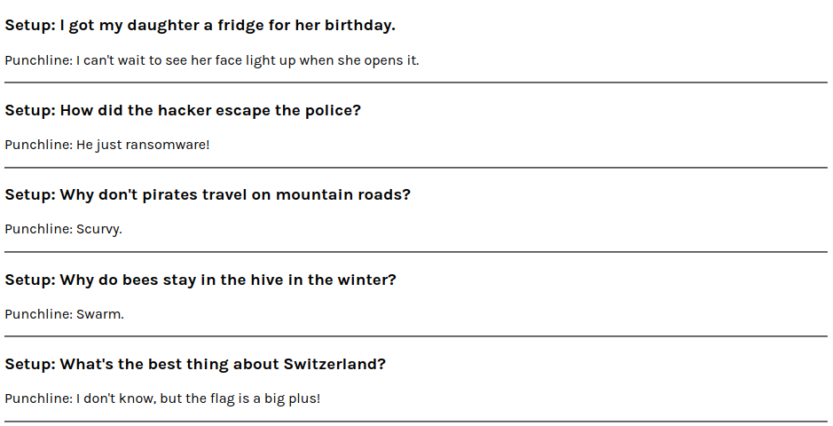

## Map React Components

### Let's map an array of objects into a React Component :

**For this, let's make some files :**

- `jokeData.js`
- `Joke.js`
- `App.js`
- `index.js`

---

```js
// jokesData.js, which returns array of objects (jokes)

export default [
  {
    setup: "I got my daughter a fridge for her birthday.",
    punchline: "I can't wait to see her face light up when she opens it.",
  },
  {
    setup: "How did the hacker escape the police?",
    punchline: "He just ransomware!",
  },
  {
    setup: "Why don't pirates travel on mountain roads?",
    punchline: "Scurvy.",
  },
  {
    setup: "Why do bees stay in the hive in the winter?",
    punchline: "Swarm.",
  },
  {
    setup: "What's the best thing about Switzerland?",
    punchline: "I don't know, but the flag is a big plus!",
  },
];
```

---

```js
// Joke.js is our Joke component
export default function Joke(props) {
  return (
    <div>
      <h3>{props.setup}</h3>
      <p>{props.punchline}</p>
    </div>
  );
}
/* setup and punchline are props given to Joke Component in App.js at the time of rendering */
```

---

```js
// App.js, Here happens the magic
import jokesdata from "./jokedata";

export default function App() {
  const jokeElements = jokesData.map((joke) => {
    return <Joke setup={joke.setup} punchline={joke.punchline} />;
  });
  return <div>{jokeElements}</div>;
}
```

---

```js
// index.js

import React from "react";
import ReactDOM from "react-dom";
import App from "./App";

const root = ReactDOM.createRoot(document.getElementById("root"));
root.render(<App />);
```

---

## Output:



## Let's Breakdown our App.js

```js
import jokesdata from "./jokedata";

export default function App() {
  const jokeElements = jokesdata.map((joke) => {
    return <Joke setup={joke.setup} punchline={joke.punchline} />;
  });
  return (
    <div>
      <section>{jokeElements}</section>
    </div>
  );
}
```

---

- `import jokesData from "./jokedata"`

  Importing Our Jokes from `jokedata.js` file.

---

- const `jokeElement`

  A JavaScript variable which is holding our mapped array values.

---

- `jokesdata.map()`

  Using map function on our imported `jokesdata`.

---

- `(joke) => {...}`

  An arrow function which holds "joke" as a prameter, this is a callback function which returns our <`Joke /> `component.

---

- `return <Joke setup = value punchline = value`

  Returning our `<Joke />` component with two props, **setup** and **punchline**. Note that you change this props name as they are limited to this file.

---

- `{joke.setup} {joke.punchline}`

  By passing **joke.setup** and **joke.punchline** as value to the setup and punchline props, we can access the setup & punchline props passed to the Joke Component.

---

- `return <div>{jokeElements}</div>`

  A normal Component return statement which returns `jokeElement` inside `<div>`

---

```js
// more simplification :-
export default function App() {
  const anyVariable = ourJokesArray.map((joke) => {
    return <Component props props />;
  });
  return <div>{anyVariable}</div>;
}
```

---

## For Revision :

1.  **What does the `.map()` array method do?**

    Returns a new array. Whatever gets returned from
    the callback
    function provided is placed at the same index in the new array.
    Usually we take the items from the original array and modify them
    in some way.

---

2.  **What do we usually use `.map()` for in React?**

    Convert an array of raw data into an array of JSX elements
    that can be displayed on the page.

---

3.  **Why is using `.map()` better than just creating the components manually by typing them out?**

    It makes our code more "self-sustaining" - not requiring
    additional changes whenever the data changes.

---
