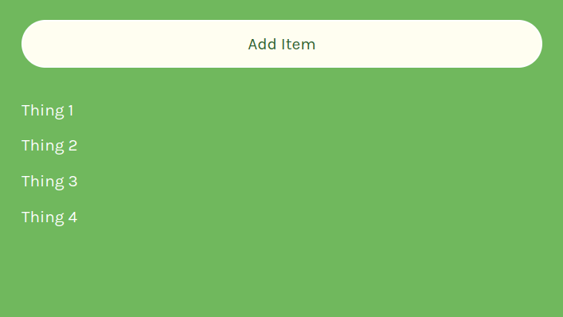

## Changing States

If you ever need the old-value of state to help you determine the new-value of state, you should **pass a callback function** to your state setter function instead of using state directly.

```js
function Handler() {
  setCount(callBackFn());
}
```

This callback function will receive the old-value of state as its parameter, which you can then use to determine your new-value of state.

---

```js
// example of an eventHandler function which changes the state of count.

function add() {
  setCount((prevCount) => prevCount + 1);
}
```

Considering the naming convention for parameter of the call back function in `setCount`, we can add a prefix `prev` which then defines the previous state and makes it more easy to understand.

**The `prevCount` parameter is the current state of the `useState` which is then changed to an another state.**

---

## Example of using "previous state" values

```js
import React from "react"

export default function MyMind(){

  bool [isGoingOut, setIsGoingOut] = React.useState(true)

  function changeMind(){
    setIsGoingOut(prevMind => !prevMind )
  }

// changing the state to opposite of previous state, hence using a callback function. Note that this function can return anything like boolean expression, an array, etc.

  return (
    <h1> Do I feel like going out tonight?</h1>
      <div onClick={changeMind}>
        <h1>{isGoingOut ? "Yes" : "NO"}</h1>
      </div>
    </div>
  )
}
```

---

## One More Example

**Below Example contains only AddItem Component as it's main focus, `html` and `css` files are not included.**

```js
// An AddItem component which just adds things in a list.

import React from "react";
import ReactDOM from "react-dom";

export default function AddItems() {
  const [thingsArray, setThingsArray] = React.useState(["Thing 1"]);

  const thingsElement = thingsArray.map((thing) => <p>{thing}</p>);

  function addItem() {
    setThingsArray((prevState) => [
      ...prevState,
      `Thing ${prevState.length + 1}`,
      // "..." is javascript spread operator to get all previous values.
    ]);
  }

  return (
    <div>
      <button onClick={addItem}>Add Item</button>
      {thingsElement}
    </div>
  );
}

ReactDOM.render(<AddItems />, document.getElementById("root"));
```

## Output :

## 

## useState in Objects

### A state can not only be an array but can also be set to an object.

```js
const [info, setInfo] = React.useState({
    name: "Amit",
    age: "20"
    isadult: true
})

const isElegible = state.isadult ? "Yes" : "No"

console.log(isElegible) // Yes
```

## Quick Revision :

1.  **You have 2 options for what you can pass in to a
    state setter function (e.g. `setCount`). What are they?**

    ans 1. **New value** of state (setCount(42))

    ans 2. **Callback function**- whatever the callback function returns === new value of state.

---

2.  **When would you want to pass the first option (from answer above) to the state setter function?**

    Whenever you don't need the previous value of state to determine what the new value of state should be.

---

3.  **When would you want to pass the second option (from answer above) to the state setter function?**

    Whenever you DO need the previous value to determine the new value.

---
