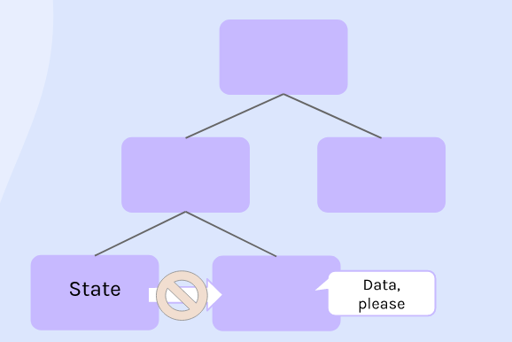
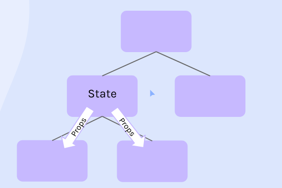
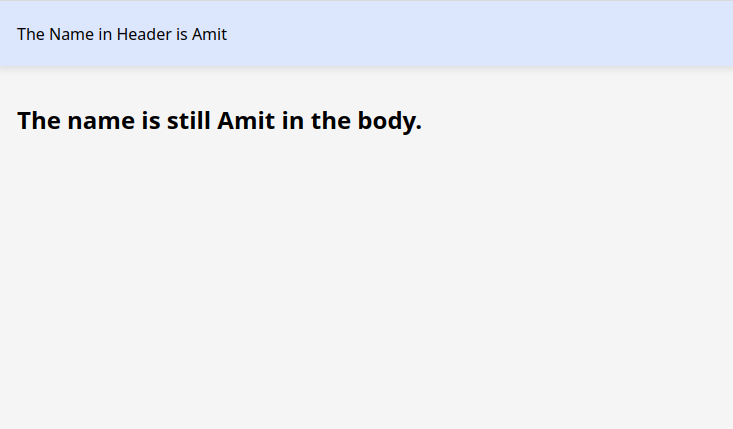
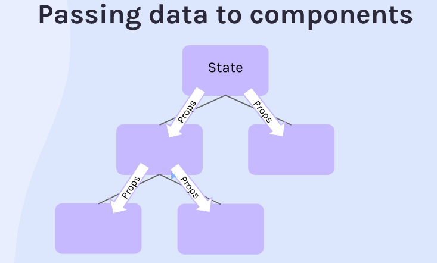

## How data is passed through a Component to other another ?

**In react DOM tree, the Top / Parent component renders the other Children components, which can be represented as a Tree Data Structure where the branches represents that the Top component is rendring the upcoming chlid components.**

---

**In the below image, we can see that when the sibling element needs the data from the state, the other sibling can't send it directly as they are seperate components and have no reference to each other :**



---

However, if we pass the State to the the upper parent element, then both of the child components have it's access and can use them. This happens with the help of "Props". And if the State is supposed to be changed, React will automatically change the state of child Components. Refer the below image to understand it clearly :



---

## Example :

**Below exists 3 seperate components, `Header.js`, `Body.js` and `App.js`. Here, `App` is the Parent component whereas `Header` and `Body` are Child components.**

```js
// App.js

import React from "react";

export default function App() {
  const [user, setUser] = React.useState("Amit");
  return (
    <div>
    <!--
    Passing props to the Childs from the State
    -->
      <Header name={user} />
      <Body name={user} />
    </div>
  );
}
```

---

```js
// Header.js

// receiving props in the component
export default function Header(props) {
  return <header>The Name in Header is {props.name}</header>;
}

// using props.user to access the state of Parent App Component. Note that we've used ".name" method for the props because the prop passed to the rendered component in App is "name".
```

---

```js
// Body.js

export default function Body(props) {
  return <h2>The name is still {props.name} in the body.</h2>;
}

//same
```

## Output :



---

## In Conclusion


